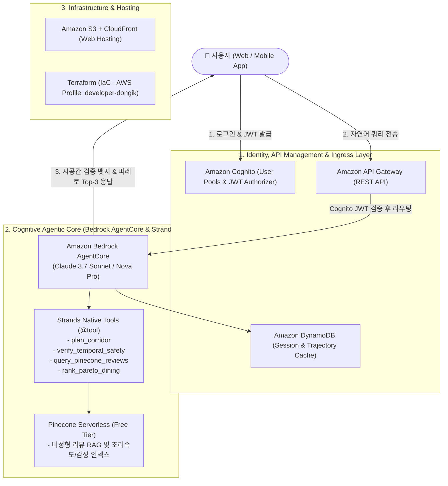

# WayBite (웨이바이트) 🚗 🚇 🍽️
> **국내 최초 시공간 경로 최적화 맛집 추천 에이전트**  
> *Spatio-Temporal Route-Optimized Dining Agent powered by Amazon Bedrock AgentCore & Strands*

---

## 📌 1. 프로젝트 개요 (Overview)
기존 맛집 지도 서비스(네이버 지도, 카카오맵, TMAP 등)는 "현재 위치 반경 N km" 또는 목적지 검색에 머물러 있어, **출발지에서 목적지로 이동하는 도중(환승역, 고속도로 IC 회랑)의 식사 계획**을 세우기 어렵습니다.

**WayBite(웨이바이트)**는 사용자의 **출발지, 목적지, 이동 수단(대중교통, 자가용, 도보, 자전거)**을 기반으로:
1. **이동 경로 회랑(Spatio-Temporal Corridor) 버퍼링**을 통해 최소 우회(Pareto Detour) 식당군을 추출하고,
2. 식당 도착 예정 시각($T_{\text{ETA}}$)을 정밀 계산하여 **브레이크타임(Break Time)과 라스트오더(Last Order) 시간표 충돌을 원천 차단**하는 **시공간 안전 가드레일(Temporal Safety Guardrail)**을 적용하며,
3. **Pinecone Serverless(Free Tier) 비정형 리뷰 RAG**를 통해 조리 속도(5분 컷), 혼밥 난이도, 주차 편의성을 정량화하여 최적의 Top-3 식당을 제안합니다.

---

## 🏛️ 2. 시스템 아키텍처 (System Architecture)



---

## ⚙️ 3. 기술 스택 (Tech Stack)

| 구분 | 기술 / 서비스 | 상세 역할 |
| :--- | :--- | :--- |
| **인공지능 오케스트레이션** | **Amazon Bedrock AgentCore** | `@aws/agentcore` CLI (v0.15.0) 기반 관리 및 프로비저닝 |
| **에이전트 프레임워크** | **Strands SDK** | AWS 네이티브 초경량 비동기 스트리밍 에이전트 프레임워크 |
| **기반 파운데이션 모델** | **Claude 3.7 Sonnet / Nova Pro** | 하이브리드 추론(Extended Thinking) 기반 시공간 제약조건 해결 |
| **벡터 데이터베이스 (RAG)** | **Pinecone Serverless (Free Tier)** | 비정형 리뷰 시맨틱 인덱싱 ($0 유휴 비용, 실시간 서빙 지연 <50ms) |
| **인프라 자동화 (IaC)** | **Terraform** | AWS Profile: `developer-dongik`, 모듈형 인프라 자동화 |
| **사용자 인증 & 보안** | **Amazon Cognito** | User Pool, Identity Pool, JWT 기반 보안 검증 |
| **세션 & 캐시 스토리지** | **Amazon DynamoDB** | 경로 폴리라인 및 사용자 세션 상태 초고속 캐시 |
| **게이트웨이 & 호스팅** | **API Gateway + S3 + CloudFront** | 글로벌 CDN 엣지 배포 및 REST API 게이트웨이 |

---

## 📂 4. 프로젝트 디렉토리 구조 (Repository Layout)

```
.
├── README.md                                  # 메인 프로젝트 소개서
├── .gitignore                                 # 보안 및 환경 제외 파일 정의
├── docs/                                      # 기획 & 아키텍처 상세 문서 (4종)
│   ├── 01_project_overview_and_architecture.md
│   ├── 02_data_schemas_and_api_spec.md
│   ├── 03_demo_scenarios_and_user_flows.md
│   └── 04_tech_stack_and_implementation_roadmap.md
├── terraform/                                 # AWS 베이스 인프라 (IaC)
│   ├── main.tf
│   ├── variables.tf
│   ├── outputs.tf
│   ├── terraform.tfvars.example
│   └── modules/ (cognito, dynamodb, api_gateway, s3_cloudfront)
└── agentcore/                                 # Bedrock AgentCore + Strands 프로젝트
    ├── agentcore.json                         # AgentCore CLI 설정 파일
    └── app/waybite_agent/
        ├── main.py                            # Strands 에이전트 진입점
        ├── tools/                             # 시공간 최적화 도구군 (@tool)
        │   ├── corridor.py                    # 경로 회랑 탐색 (plan_corridor)
        │   ├── temporal.py                    # 시간표 가드레일 (verify_temporal_safety)
        │   ├── reviews.py                     # Pinecone 리뷰 마이닝 (query_pinecone_reviews)
        │   └── pareto.py                      # 파레토 다변수 랭킹 (rank_pareto_dining)
        └── pyproject.toml                     # Python 의존성 관리 (uv)
```

---

## 🚀 5. 로컬 실행 및 테스트 (Quick Start)

### 1) AgentCore 프로젝트 유효성 검사
```bash
cd agentcore/agentcore
AWS_PROFILE=developer-dongik npx @aws/agentcore validate
```

### 2) Strands 파이프라인 로컬 단위 테스트
```bash
cd agentcore/app/waybite_agent
uv run python -c "
from tools.corridor import plan_corridor
from tools.temporal import verify_temporal_safety
from tools.reviews import query_pinecone_reviews
from tools.pareto import rank_pareto_dining

corr = plan_corridor(origin='판교역', destination='강남역', transport_mode='TRANSIT')
print('후보군 수:', corr['candidate_count'])
"
```

### 3) Terraform 인프라 검증
```bash
cd terraform
terraform init -backend=false
terraform validate
terraform plan -var="aws_profile=developer-dongik"
```
