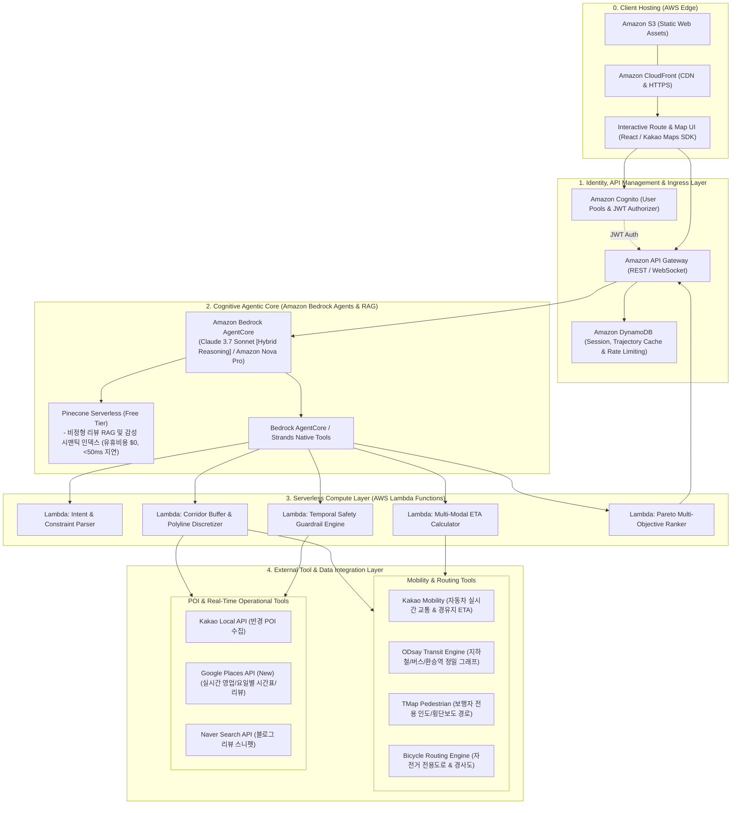

# 01. 프로젝트 개요 및 아키텍처 정의서 (Project Overview & Architecture)

## 📌 1. 프로젝트 기본 정보
* **프로젝트명:** WayBite (웨이바이트)
* **부제:** Spatio-Temporal Route-Optimized Dining Agent
* **슬로건:** *"출발지부터 목적지까지, 내 동선과 시간을 완벽하게 지켜주는 시공간 최적화 맛집 에이전트"*
* **대응 이동수단:** 🚗 자동차 · 🚇 대중교통(지하철/버스) · 🚶 뚜벅이(도보) · 🚲 자전거 (4대 이동수단 전면 지원)

---

## 🔍 2. 문제 정의 및 시장 현황 (Problem Statement & Market Gap)

### 2.1 일상에서의 페인포인트 (The Pain Point)
1. **이동 중 식사 선택의 높은 피로도:** A에서 B로 이동할 때, 식사를 해결하고 싶지만 기존 지도 앱은 '출발지 주변'이나 '도착지 주변'만 주로 추천함.
2. **동선 낭비(Detour) 계산의 어려움:** 마음에 드는 식당을 찾았으나, 내 이동 경로에서 얼마나 벗어나는지(+5분? +25분?)를 직관적으로 파악하기 어려움.
3. **시간 불일치(Temporal Mismatch) 참사:** 실제 이동 시간을 감안했을 때, **식당에 도착하는 시점(미래 시점)에 브레이크 타임이거나 라스트오더가 마감**되어 헛걸음하는 경험 빈번.

### 2.2 국내 기존 서비스의 한계 분석 (Market Competitor Analysis)
| 서비스명 | 현재 지원 기능 | 치명적 한계 |
| :--- | :--- | :--- |
| **티맵 (TMAP)** | '주행중 어디갈까' 경로상 추천 | **100% 자가용 운전자 전용.** 사용자의 자연어 취향/맥락 반영 불가, 단순 방문자 랭킹 순 나열 |
| **카카오맵** | 'AI메이트 / 카나나' 대화형 추천 | **특정 고정 지역 기반 챗봇.** 출발지-목적지 간 '이동 경로(Polyline)'를 고려한 추천 기능 전무 |
| **네이버 지도** | 대중교통 길찾기 & 주변 검색 | 대중교통 이용자는 **환승역을 직접 확인하고 별도로 검색창에 입력하여 식당을 일일이 눌러봐야 하는 수동 노가다** 발생 |
| **공통 한계** | 영업시간 표시 | 모든 앱이 **"현재(지금) 영업 중인가?"**만 판정. **미래 도착 예정 시각($T_{\text{ETA}}$) 기준의 브레이크타임/라스트오더 가드레일은 국내 서비스 전무** |

---

## 🏆 3. WayBite의 3대 독점적 기술 경쟁력 (Core Tech Edges)

1. **미래 도착 시점($T_{\text{ETA}}$) 기반 시공간 안전 가드레일 (Temporal Safety Guardrail):**
   * 출발 시각과 이동수단별 소요시간을 계산하여, $T_{\text{ETA}}$ 시점에 라스트오더가 끝났거나 브레이크타임 직전인 식당을 100% 원천 차단.
2. **대중교통 환승역 그래프 & 보행 결합 추론 (Transit-Walk Integrated Reasoning):**
   * ODsay API를 활용하여 지하철/버스 환승역에서 내려서 식사하고 다시 탑승하는 최적 환승 노드 및 도보 동선을 자동 계산.
3. **비정형 리뷰 마이닝 기반 이동 제약 추출 (Deep Review RAG):**
   * 정형 필터에 없는 메트릭(*"음식 조리 속도 5분 컷 vs 30분 소요"*, *"혼밥 적합도"*, *"주차 난이도"*)을 수백 개 리뷰 텍스트 임베딩을 통해 정량 점수화.

---

## 🏗️ 4. 시스템 High-Level 아키텍처 (AWS Serverless & Bedrock AgentCore)

---

## 📐 5. 핵심 알고리즘 및 수학적 모델 (Mathematical Formulation)

### 5.1 다목적 파레토 최적화 목적함수 (Multi-Objective Function)
$$\max_{R \in \mathcal{C}} \text{Score}(R) = w_1 \cdot S_{\text{semantic}}(R) + w_2 \cdot S_{\text{quality}}(R) - w_3 \cdot \Delta T_{\text{detour}}(R) - w_4 \cdot T_{\text{friction}}(R)$$

* $S_{\text{semantic}}(R)$: 사용자 요구사항(자연어 프롬프트)과 식당 메타데이터/리뷰 간의 코사인 유사도 ($0 \sim 1$)
* $S_{\text{quality}}(R)$: 정규화된 평점 및 긍정 리뷰 비율 ($0 \sim 1$)
* $\Delta T_{\text{detour}}(R)$: **순수 우회 페널티 시간**
  $$\Delta T_{\text{detour}} = \text{Time}(A \to R \to B) - \text{Time}(A \to B)$$
* $T_{\text{friction}}(R)$: 현장 대기시간 + 음식 조리 대기시간 + 주차/도보 환승 시간
* $w_1, w_2, w_3, w_4$: 사용자 설정 및 슬라이더에 따른 동적 가중치 벡터

### 5.2 시간적 안전 제약조건 (Hard Constraints)
$$T_{\text{ETA}}(R) + \delta_{\text{buffer}} \le T_{\text{last\_order}}(R) \quad (\delta_{\text{buffer}} \ge 5\text{분})$$
$$[T_{\text{ETA}}(R), \; T_{\text{ETA}}(R) + T_{\text{dining}}] \cap [T_{\text{break\_start}}(R), \; T_{\text{break\_end}}(R)] = \emptyset$$
$$\Delta T_{\text{detour}}(R) \le \Delta T_{\text{max\_detour}}$$

---

## 🔄 6. End-to-End 데이터 처리 플로우 (AWS Serverless Lifecycle)

1. **User Authentication & Ingestion:** 클라이언트가 `Amazon Cognito`를 통해 인증된 후, `Amazon CloudFront + S3`의 웹 앱에서 자연어 요청 전송 $\to$ `Amazon API Gateway (Cognito Authorizer 검증)` 접수.
2. **Bedrock AgentCore Orchestration:** Bedrock Agent가 프롬프트를 해석하고 `Action Groups`를 통해 필요한 서버리스 Lambda 함수 호출 시퀀스 계획.
3. **Trajectory & Hub Discretization (Lambda):** 모빌리티 API 호출 $\to$ 경로 폴리라인(좌표열) 및 대중교통 환승역 노드 생성 후 `DynamoDB`에 세션 저장.
4. **Spatial Corridor Search (Lambda):** 경로 주변 $500\text{m}\sim 1\text{km}$ 회랑 내 1차 식당군 50~100개 수집 (카카오 로컬 API).
5. **Temporal Safety Guardrail (Lambda - 1차 컷):** 각 식당별 $T_{\text{ETA}}$ 계산 $\to$ 브레이크타임/라스트오더 충돌 식당 즉시 탈락 $\to$ 유효 후보 15~20개 압축.
6. **Review RAG & Scoring (Pinecone Serverless - 2차 컷):** Pinecone Serverless 벡터 인덱스를 통해 조리속도, 혼밥/주차 적합도 점수화.
7. **Pareto Optimization & Synthesis (Lambda + Bedrock):** Pareto Top-3 도출 후 최종 브리핑 생성 $\to$ API Gateway를 통해 프론트엔드 지도에 시각화 반환.

---

## 🛠️ 7. 시스템 인프라 및 외부 연동 API 인벤토리

| 분류 | 컴포넌트 / API 명칭 | 용도 및 특징 |
| :--- | :--- | :--- |
| **🔐 사용자 인증** | **Amazon Cognito** | User Pools & Identity Pools 기반 JWT 인증, 개인화 프로필 관리 |
| **☁️ 클라우드 인프라** | **AWS Lambda & API Gateway** | 무상태(Stateless) 고속 서버리스 백엔드 컴퓨팅 및 JWT Authorizer |
| **🛠️ IaC & 자동 배포** | **Terraform (HCL)** | 모듈형 클라우드 인프라 선언적 프로비저닝 및 S3/CloudFront 배포 |
| **🧠 AI AgentCore** | **Amazon Bedrock AgentCore + Strands** | Strands 프레임워크 & Claude 3.7 Sonnet / Nova Pro 기반 초경량 스트리밍 오케스트레이션 |
| **📚 벡터 검색 RAG** | **Pinecone Serverless (Free Tier)** | 비정형 리뷰 시맨틱 인덱싱 ($0 유휴 비용, 실시간 서빙 지연시간 <50ms) |
| **💾 세션 & 캐시** | **Amazon DynamoDB** | 경로 폴리라인 및 세션 컨텍스트 초고속 NoSQL 캐시 |
| **🌐 프론트엔드 호스팅** | **Amazon S3 + CloudFront** | 글로벌 CDN 엣지 배포 및 SSL/HTTPS 자동 적용 |
| **🚗 자동차 경로** | **카카오 모빌리티 API** | 실시간 교통량 반영 경로 탐색, 경유지 추가 소요시간 계산 |
| **🚇 대중교통 경로** | **ODsay 대중교통 API** | 전국 지하철/버스 환승역 좌표, 실시간 배차 대기시간, 도보 환승 시간 |
| **🚶 보행자 경로** | **TMap 보행자 API** | 골목길, 횡단보도, 경사도 반영 정밀 도보 소요시간 산출 |
| **🚲 자전거 경로** | **카카오/네이버 자전거 API** | 자전거 전용도로 우선 경로 및 소요시간 산출 |
| **📍 장소 수집** | **카카오 로컬 API** | 좌표 기반 반경 내 음식점 카테고리 고속 쿼리 |
| **🕒 영업/리뷰 수집** | **Google Places API (New)** | 요일별 정기휴무, 브레이크타임, 라스트오더, 상세 리뷰 |
