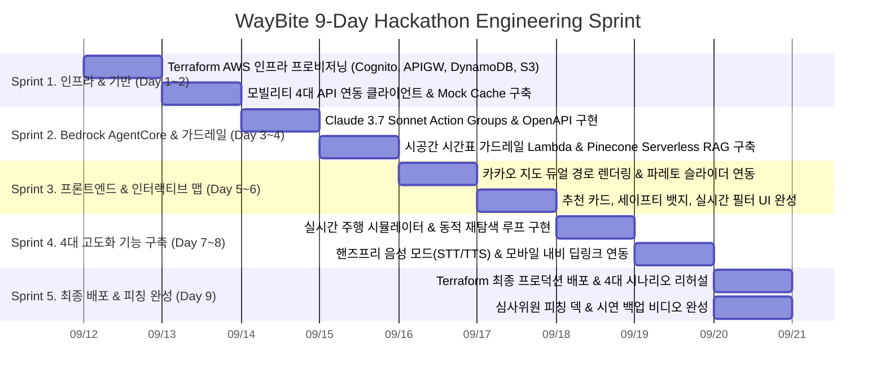

# 04. 기술 스택 및 개발 로드맵 (Tech Stack & Implementation Roadmap)

본 문서는 **WayBite (웨이바이트)**의 실제 구현을 위한 **AWS Serverless 백엔드 및 Amazon Bedrock AgentCore** 기반 기술 스택 선정 이유, 레포지토리 폴더 구조, 그리고 해커톤 기간 내 완성하기 위한 단계별 구현 로드맵(Phased Roadmap)을 정의합니다.

---

## 💻 1. 기술 스택 선정 및 선정 이유 (Tech Stack & Rationale)

```
[Frontend (AWS Edge)]          [Serverless AI & Backend]             [IaC & Infra Management]
React 18 + Vite                Amazon Bedrock Agents (AgentCore)     Terraform (HCL)
TypeScript                     Claude 3.7 Sonnet (Hybrid Reasoning)  AWS Provider (~> 5.0)
Kakao Maps Web SDK / Leaflet   Amazon Nova Pro / Claude 3.5 Haiku    Remote S3 State + DynamoDB Lock
Tailwind CSS + Framer Motion   AWS Lambda (Python 3.12 / Serverless) 
Amazon S3 + CloudFront         Amazon API Gateway (REST API)         [Data & External APIs]
                               Amazon Cognito (User Auth & JWT)      Kakao Mobility API
                               Amazon DynamoDB (Cache & Session)     ODsay Transit API
                               Bedrock Knowledge Base (RAG)          TMap Pedestrian API
                                                                     Google Places API (New)
```

### 1.1 Frontend: React (Vite) + TypeScript + Kakao Maps SDK (S3 & CloudFront)
* **선정 이유:** 
  * 번들링 속도가 가장 빠르고 가벼운 Vite 기반 React 환경 구축.
  * 국내 도로망/건물 데이터가 가장 정확한 **카카오 지도 Web SDK** 채택.
  * **AWS S3 + CloudFront**를 통해 글로벌 엣지 CDN 호스팅으로 초고속 로딩 및 SSL/HTTPS 자동 적용.

### 1.2 Authentication & User Identity: AWS Cognito (User Pools & Identity Pools)
* **선정 이유:**
  * **보안 및 표준화:** OAuth 2.0 / OIDC 표준 기반의 JWT 발급으로 **Amazon API Gateway Cognito Authorizer**와 네이티브 연동.
  * **사용자 개인화 프로필:** 개인화된 식습관(비건, 알레르기, 맵기 선호도), 차량 종류(전기차/경차), 평소 도보 속도 및 즐겨찾는 경로를 `userId (sub)` 기준으로 안전하게 저장 및 관리.
  * 소셜 로그인(카카오, 구글) 확장 용이성.

### 1.3 Cognitive AI Engine: Amazon Bedrock Agents (AgentCore)
* **선정 이유:**
  * **자율 에이전트 오케스트레이션 (AgentCore):** 복잡한 시공간 추론을 단일 프롬프트가 아닌, Bedrock Agent가 Action Groups(OpenAPI 스키마 기반)를 통해 순차적·적응적으로 Lambda 함수들을 조율.
  * **Claude 3.7 Sonnet (하이브리드 추론) & Amazon Nova Pro 채택:**
    * **Claude 3.7 Sonnet:** 코딩, 도구 사용, 복합 제약조건 해결에서 독보적 1위 성능을 자랑하며, **Extended Thinking(사고 모드)**를 통해 시공간 다변수 파레토 최적화 시뮬레이션 완벽 수행.
    * **Amazon Nova Pro:** AWS 퍼스트파티 멀티모달 플래그십 모델로 고속 에이전틱 툴 콜링 지원.
    * **Claude 3.5 Haiku / Nova Lite:** 밀리초 단위 저지연이 요구되는 단순 포맷팅 및 의도 분류 라우팅 전담.
  * **Pinecone Serverless (Vector RAG):** 식당 비정형 리뷰 텍스트 및 분위기 임베딩(Amazon Titan Embeddings)을 Pinecone Serverless Free Tier에 연동하여 유휴 비용 $0, 50ms 미만 초고속 시맨틱 RAG 구현.

### 1.4 Serverless Compute & Storage: AWS Lambda + API Gateway + DynamoDB
* **선정 이유:**
  * **완전 서버리스(Serverless):** 서버 인프라 관리 없이 트래픽에 맞춰 0에서 무한대로 자동 스케일링.
  * **비동기 마이크로 함수(Micro-Lambdas):** 경로 버퍼링, 시간 검증, 랭킹 연산을 독립된 Lambda 함수로 모듈화하여 Bedrock Action Groups와 직결.
  * **Amazon DynamoDB:** 세션 상태 및 계산된 경로 폴리라인을 초저지연(Single-digit ms)으로 캐싱하여 중복 API 호출 방지 및 비용 절감.

### 1.5 Infrastructure as Code (IaC) & Deployment: Terraform
* **선정 이유:**
  * **선언적 클라우드 인프라 관리:** Cognito, API Gateway, DynamoDB, S3, CloudFront 등 AWS 베이스 인프라 리소스를 `terraform apply`로 모듈형 배포.
  * **역할 분담:** 클라우드 네트워크/인증/스토리지 인프라는 **Terraform**이 담당하고, AI 에이전트 런타임 및 수명주기는 공식 **AgentCore CLI**가 담당.

### 1.6 AI Agent Framework & Lifecycle: Strands + AgentCore CLI (`@aws/agentcore`)
* **선정 이유:**
  * **AWS Bedrock AgentCore 공식 1순위 네이티브 프레임워크 (Strands):** 
    * LangChain의 복잡하고 무거운 추상화 레이어를 걷어내고, AgentCore Runtime에 100% 최적화된 경량·고속 에이전트 프레임워크.
    * `@tool` 데코레이터를 통한 함수형 도구 정의 및 MCP(Model Context Protocol) 클라이언트 네이티브 연동 지원.
    * `agent.stream_async()`를 통한 토큰 스트리밍 및 `session_id / user_id` 세션 메모리 매니저 기본 내장.
  * **AgentCore CLI 기반 수명주기 관리:**
    * **로컬 디버깅:** `agentcore dev` 명령어로 브라우저 기반 인스펙터와 핫리로드 환경에서 실시간 프롬프트/도구 호출 추적.
    * **검증 및 배포:** `agentcore validate` 및 `agentcore deploy`를 통해 AgentCore 런타임에 직접 배포.

---

## 📁 2. 프로젝트 레포지토리 구조 (Repository Directory Structure)

```bash
wanted_aichampions/
├── docs/                               # 기획 및 아키텍처 문서 (01~04)
├── terraform/                          # [IaC] AWS 베이스 인프라 (Terraform v1.5+)
│   ├── main.tf                         # 루트 프로바이더 및 모듈 조합
│   ├── variables.tf                    # 프로젝트 공통 변수
│   ├── outputs.tf                      # API GW 엔드포인트, CloudFront 도메인 등
│   ├── terraform.tfvars.example        # 환경변수 예시 (API Keys, AWS Region)
│   └── modules/                        # 계층별 테라폼 모듈
│       ├── cognito/                    # User Pool, Client, Domain
│       ├── dynamodb/                   # Sessions, User Profiles, Route Cache
│       ├── api_gateway/                # HTTP API, Cognito JWT Authorizer
│       └── s3_cloudfront/              # 프론트엔드 S3 버킷, OAC, CloudFront CDN
├── agentcore/                          # [AI Agent] Bedrock AgentCore CLI 프로젝트
│   ├── agentcore/
│   │   ├── agentcore.json              # AgentCore 공식 프로젝트 형상 정의서
│   │   └── aws-targets.json            # 배포 타깃 및 리소스 매핑
│   ├── app/
│   │   └── waybite_agent/              # Strands 기반 네이티브 인지 에이전트
│   │       ├── main.py                 # BedrockAgentCoreApp 진입점, @tool 정의, 스트리밍
│   │       ├── model/load.py           # Bedrock 모델 로더 (Claude / Nova Pro)
│   │       ├── memory/session.py       # 세션 메모리 매니저
│   │       ├── mcp_client/             # MCP 도구 클라이언트 연동
│   │       └── pyproject.toml          # 에이전트 의존성 정의
│   └── cdk/                            # AgentCore 런타임 배포 CDK 정의
├── frontend/                           # [Client] React + Vite + 카카오 지도 SDK
│   ├── src/
│   │   ├── components/                 # MapCanvas, InputPanel, ParetoSlider 등
│   │   ├── hooks/                      # useWayBiteRoute.ts
│   │   └── types/                      # TypeScript 스키마 정의
│   ├── package.json
│   └── tailwind.config.js
└── README.md
```

---

## 🚀 3. 9일 해커톤 대비 4대 고도화 기능 명세 (Advanced Features)

9일의 개발 기간을 활용하여 단순 PoC 수준을 넘어 **실제 상용화 프로덕트 수준의 완성도와 심사위원 대상 '와우 팩터(Wow Factor)'**를 확보하기 위한 4대 고도화 기능입니다.

### 3.1 실시간 주행 시뮬레이터 & 동적 자율 재탐색 (Dynamic Re-routing Co-pilot)
* **기능 개요:** 정적인 추천에 그치지 않고, 사용자가 실제 이동하거나 시뮬레이션 GPS가 이동 중일 때 **실시간 돌발 정체 발생 시 에이전트가 능동적으로 개입**하여 대안을 제시.
* **작동 메커니즘:**
  1. 프론트엔드 시뮬레이터가 경로를 따라 초당 $N\text{m}$씩 좌표를 갱신.
  2. "교통사고/정체로 15분 지연" 이벤트 주입 시, $T_{\text{ETA}}$가 밀려 기존 추천 식당의 라스트오더 시간을 초과함을 Bedrock Agent가 감지.
  3. 에이전트가 즉각 인터랙티브 모달 알림: *"경고: 전방 정체로 기존 식당 A에 14:35 도착 예정(라스트오더 마감). 3km 전방 우회 시간 +4분의 식당 B로 자동 재탐색하시겠습니까?"*

### 3.2 운전자 전용 핸즈프리 음성 대화 모드 (Voice-First Driving Mode)
* **기능 개요:** 운전 중 스마트폰 화면을 터치할 수 없는 페인포인트를 해결하기 위해 **음성 대화 기반 경로 탐색 및 변경 인터페이스** 제공.
* **구현 스택:** Web Speech API (STT) $\to$ Amazon Bedrock AgentCore $\to$ Web Speech Synthesis / Amazon Polly (TTS).
* **동작:** 운전자가 *"가다가 10분 내로 들를 수 있는 주차 편한 카페 찾아줘"*라고 말하면, AI가 음성으로 응답하며 지도에 경유지를 음성 확인 후 자동 추가.

### 3.3 동승자 그룹 취향 조율 에이전트 (Multi-Party Consensus Voting)
* **기능 개요:** 2~4명이 함께 차를 타고 이동할 때 동승자 간 메뉴 갈등을 해결.
* **작동 메커니즘:**
  1. 운전자가 생성한 세션 링크(QR코드)로 동승자들이 각자의 모바일로 접속.
  2. 각자 선호 메뉴(예: "난 매운 거", "난 샐러드", "땅콩 알레르기")를 입력.
  3. Claude 3.7 Sonnet이 동승자들의 모든 제약조건을 만족하는 **복합 푸드코트, 대형 복합 외식 공간, 또는 중첩 타협 메뉴 식당**을 동선 상에서 도출.

### 3.4 실제 모바일 내비 1-클릭 네이티브 딥링크 (Real Mobile Navigation Integration)
* **기능 개요:** 웹 화면에서 식당을 확정한 후 스마트폰에서 터치 한 번으로 **실제 카카오내비(`kakaonavi://`) 또는 티맵(`tmap://`) 앱이 즉시 실행**되어 경유지-목적지 주행 안내를 시작.

---

## ⏱️ 4. 9일 해커톤 엔지니어링 스프린트 로드맵 (9-Day Sprint Plan)



### [Sprint 1 (Day 1~2): 인프라 기반 & 외부 API 연동]
* **Day 1:** `terraform/` 모듈 작성 및 `terraform apply`를 통해 AWS Cognito, API Gateway, DynamoDB, S3/CloudFront 일괄 생성.
* **Day 2:** 카카오 모빌리티, ODsay, TMap, Google Places API 연동 클라이언트 개발 및 데모 안정성을 위한 로컬 Mock 시드 데이터셋 구축.

### [Sprint 2 (Day 3~4): Bedrock AgentCore & 시공간 가드레일]
* **Day 3:** Bedrock Agent 생성, OpenAPI 3.0 Action Groups 등록, Claude 3.7 Sonnet의 Extended Thinking 모드 기반 파레토 다목적 랭킹 알고리즘 구현.
* **Day 4:** 도착 예정 시각($T_{\text{ETA}}$) vs 라스트오더/브레이크타임 대조 시간표 가드레일 Lambda 및 Bedrock Knowledge Base 리뷰 RAG 파이프라인 완성.

### [Sprint 3 (Day 5~6): 프론트엔드 인터랙티브 지도 & 코어 UI]
* **Day 5:** React + 카카오 지도 SDK 연동, 직행 경로(파란 실선)와 경유 경로(주황 점선) 실시간 렌더링, 파레토 가중치 슬라이더 연동.
* **Day 6:** 세이프티 타임라인 뱃지(🟢/🟡/🔴), 추천 근거 브리핑 카드, 필터 패널 완성.

### [Sprint 4 (Day 7~8): 4대 고도화 기능 구현 (Game Changer)]
* **Day 7:** **실시간 주행 시뮬레이터** 및 정체 감지 시 자율 동적 재탐색 모달 구현.
* **Day 8:** **운전자 핸즈프리 음성 인터페이스(STT/TTS)** 및 스마트폰 원클릭 **카카오내비/티맵 딥링크** 연동, 동승자 투표 QR 프로토타입 구현.

### [Sprint 5 (Day 9): E2E 검증, 성능 최적화 & 피칭 완성]
* **Day 9:** 전체 시나리오 E2E 통합 테스트, 프론트엔드 S3/CloudFront 최종 빌드 및 캐시 무효화, 발표 피칭 슬라이드 및 무대 시연 백업 비디오 녹화.

---

## 🛡️ 5. 위험 관리 및 장애 대응 전략 (Risk Management)

| 위험 요소 (Risk) | 발생 상황 | 사전 대응 전략 (Fallback Strategy) |
| :--- | :--- | :--- |
| **외부 API 호출 지연 (Latency)** | 카카오/구글 API가 3초 이상 응답하지 않을 때 | 모든 주요 경로(강남-판교, 잠실-속초 등)의 API 응답을 **DynamoDB에 사전 캐싱(Seed Data)**하여 0.2초 즉시 응답 보장 |
| **식당 영업시간 데이터 누락** | 신생 매장으로 라스트오더 시간이 없을 때 | Claude 3.7 Sonnet 에이전트가 최신 네이버 블로그 리뷰 텍스트에서 *"라스트오더는 14:30까지래요"* 문장을 자율 추출하여 대체 |
| **지도 API 일일 쿼리 초과** | 해커톤 테스트 중 API 쿼리 한도 도달 | 카카오맵 키 2개 분산 및 개발 환경용 OpenStreetMap/Leaflet fallback 스위치 준비 |
| **무대 현장 네트워크 단절** | 현장 Wi-Fi 장애로 인터넷 불가 | 로컬 환경에서 실행 가능한 Mock API 모드 및 사전 녹화된 고화질 WebP 시연 비디오 완비 |
